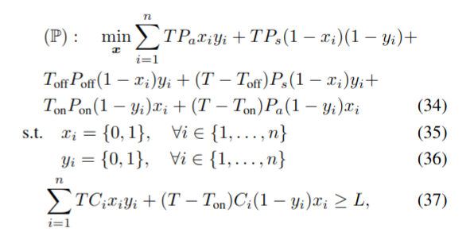

# OptimizationMethods
In this project, we share the algorithms related to the research paper "Energy efficiency in O-RAN through sleep modes", accepted at the ICC conference 2025.

We developed in Python a set of algorithms to address the following optimization problem:

